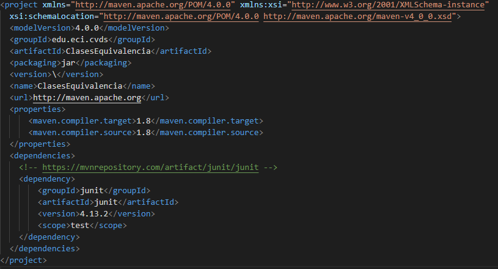
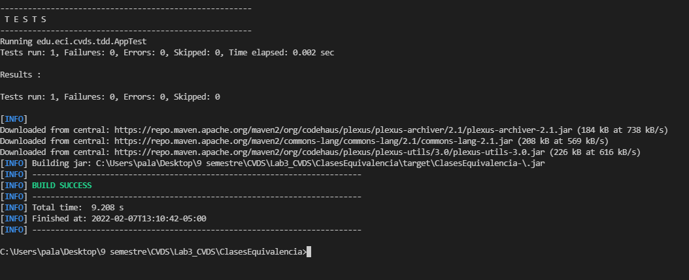
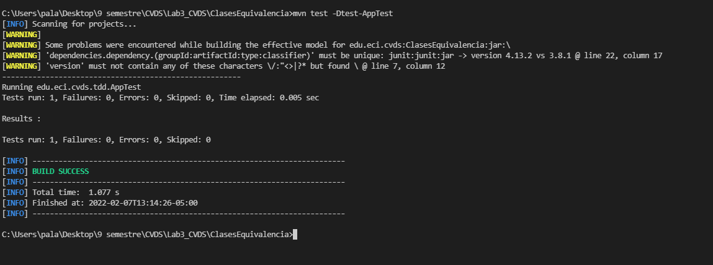
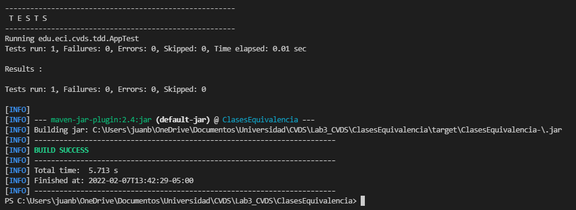
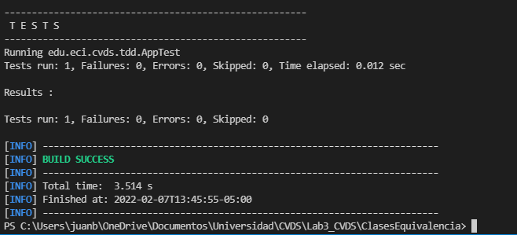
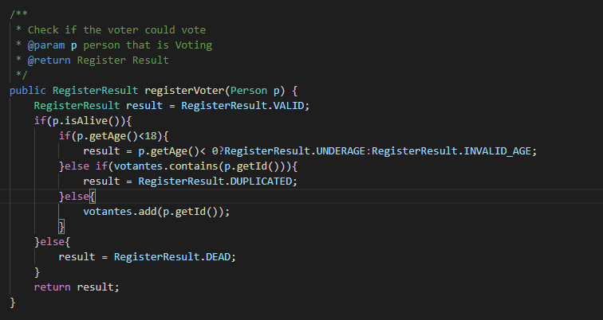
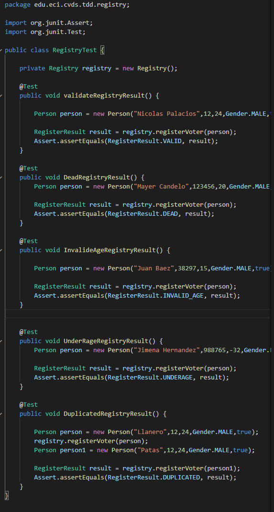
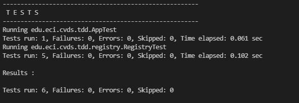
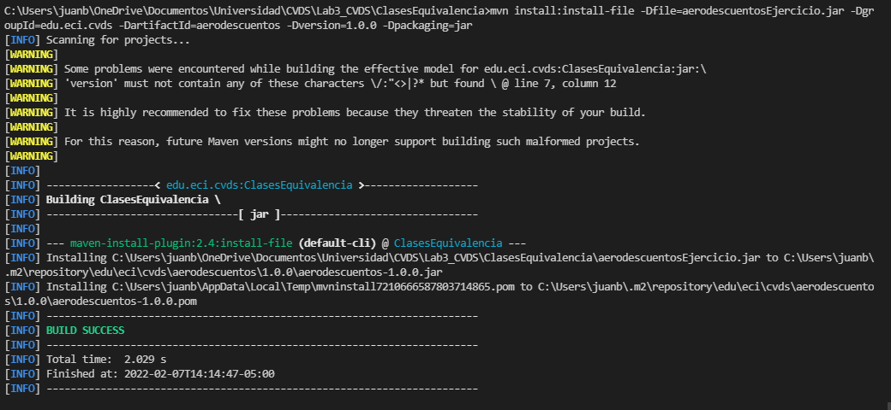
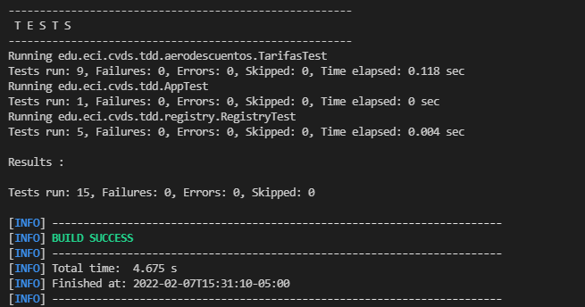

# Lab3_CVDS
### Integrantes
- Juan Carlos Baez Lizarazo
- Nicolas Fernando Palacios Fajardo
### Clases de equivalencia     
- En el directorio de trabajo ejecutar el comando necesario para crear un proyecto maven, basado en un arquetipo:
    - Grupo: edu.eci.cvds
    - Artefacto: ClasesEquivalencia
    - Paquete: edu.eci.cvds.tdd
    - archetypeArtifactId: maven-archetype-quickstart

Para ello vamos a usar el siguiente comando:  
- mvn archetype:generate -DgroupId=edu.eci.cvds -DartifactId=ClasesEquivalencia -Dpackage=edu.eci.cvds.tdd -DarchetypeArtifactId=maven-archetype-quickstart

### ACTUALIZAR Y CREAR DEPENDENCIAS EN EL PROYECTO
- Busque en internet el repositorio central de maven.
- Busque el artefacto JUnit y entre a la versión más nueva
- Ingrese a la pestaña de Maven y haga click en el texto de la dependencia para copiarlo al portapapeles.
- Edite el archivo pom.xml y realice las siguientes actualizaciones:
    - Agregue la dependencia copiada a la sección de dependencias.
    - Hay que cambiar la versión del compilador de Java a la versión 8, para ello, agregue la sección properties antes de la sección de dependencias:
    ~~~ 
    <properties>
        <maven.compiler.target>1.8</maven.compiler.target> 
        <maven.compiler.source>1.8</maven.compiler.source>

    </properties>

### COMPILAR Y EJECUTAR
- Ejecute los comandos necesarios de Maven, para compilar el proyecto y verificar que el proyecto se creó correctamente y los cambios realizados al archivo pom no generan inconvenientes.

- Busque el comando requerido para ejecutar las pruebas unitarias de un proyecto desde Maven y ejecútelo sobre el proyecto. Se debe ejecutar la clase AppTest con resultado exitoso.

### EJERCICIO “REGISTRADURÍA”
Se va a crear un proyecto base para un requerimiento de la registraduría en el cual se registrarán personas con intención de votar paras las próximas elecciones y se generarán los certificados electorales de aquellas personas cuyo voto sea válido.

Se usará la clase de persona que ya fue creada. El servicio de la registradiría permitirá registrar personas que sean votantes

### PROPIEDADES
- Sólo se registrarán votantes válidos
- Sólo se permite una inscripción por número de documento

### HACER EL ESQUELETO DE LA APLICACION
- Cree el archivo RegisterResult.java en el directorio edu.eci.cvds.tdd.registry con la enumeración:
    ~~~
    package edu.eci.cvds.tdd.registry;

    public enum RegisterResult {
            DEAD, UNDERAGE, INVALID_AGE, VALID, DUPLICATED
    }
- Cree el archivo Gender.java en el paquete edu.eci.cvds.tdd.registry con la enumeración:
package edu.eci.cvds.tdd.registry;

    ~~~
    public enum Gender {

        MALE, FEMALE, UNIDENTIFIED;
    }  

- Cree el archivo Person.java en el paquete edu.eci.cvds.tdd.registry con el siguiente contenido:
    ~~~
    package edu.eci.cvds.tdd.registry;

    /**
    * Person representation Class
    */
    public class Person {

        /**
        * Person's name
        */
        private String name;

        /**
        * A person's identification number
        */
        private int id;

        /**
        * Person's age
        */
        private int age;

        /**
        * Person's gender
        */
        private Gender gender;
        
        /**
        * Flag to specify if a person is alive
        */
        private boolean alive;

        /**
        * The class' default constructor
        */
        public Person() {
            super();
        }

        /**
        * A person constructor with all the information
        *
        * @param name the name
        * @param id the identification number
        * @param age the age
        * @param gender the gender
        * @param alive if the person is alive
        */
        public Person(String name, int id, int age, Gender gender, boolean alive) {
            this.name = name;
            this.id = id;
            this.age = age;
            this.gender = gender;
            this.alive = alive;
        }

        /**
        * Returns the person name
        * 
        * @return the name
        */
        public String getName() {
            return name;
        }

        /**
        * Returns the person identification number
        * 
        * @return the identification Number
        */
        public int getId() {
            return id;
        }

        /**
        * Returns this person's age
        * 
        * @return the age
        */
        public int getAge() {
            return age;
        }

        /**
        * Returns the gender
        * 
        * @return the gender
        */
        public Gender getGender() {
            return gender;
        }

        /**
        * Returns if the person is alive
        * 
        * @return the alive
        */
        public boolean isAlive() {
            return alive;
        }

        /**
        * Sets the person name
        * 
        * @param name the name to set
        */
        public void setName(String name) {
            this.name = name;
        }

        /**
        * Sets the person identification number
        * 
        * @param id the identification Number to set
        */
        public void setId(int id) {
            this.id = id;
        }

        /**
        * Sets the person age
        * 
        * @param age the age to set
        */
        public void setAge(int age) {
            this.age = age;
        }

        /**
        * Sets the person gender
        * 
        * @param gender the gender to set
        */
        public void setGender(Gender gender) {
            this.gender = gender;
        }

        /**
        * Sets the flag to specify if this person is alive
        * 
        * @param alive the alive to set
        */
        public void setAlive(boolean alive) {
            this.alive = alive;
        }

        /**
        * @{inheritdoc}
        */
        @Override
        public String toString() {
            return "Person [name=" + name + ", id=" + id + ", age=" + age + ", gender=" + gender + ", alive=" + alive + "]";
        }

    }
- Cree el archivo Registry.java en el directorio edu.eci.cvds.tdd.registry con el método registerVoter:
    ~~~
    package edu.eci.cvds.tdd.registry;

    public class Registry {
        public RegisterResult registerVoter(Person p) {

            // TODO Validate person and return real result.
            return RegisterResult.VALID;
        }
    }
- Cree la misma estructura de paquetes edu.eci.cvds.tdd.registry en la ruta src/test/java. Todos los archivos relacionados específicamente con los temas de pruebas, siempre deben ir bajo la carpeta test.
- Bajo la carpeta de pruebas, cree la clase RegistryTest.java en el directorio edu.eci.cvds.tdd.registry de la siguiente manera:

    ~~~
    package edu.eci.cvds.tdd.registry;

    import org.junit.Assert;
    import org.junit.Test;

    public class RegistryTest {

        private Registry registry = new Registry();

        @Test
        public void validateRegistryResult() {

            Person person = new Person();

            RegisterResult result = registry.registerVoter(person);

            Assert.assertEquals(RegisterResult.VALID, result);
        }

        // TODO Complete with more test cases
    }

### EJECUTAR LAS PRUEBAS

- Para correr las pruebas utilice
    <pre>$ mvn package</pre>
    
- Tambien puede utilizar:
    <pre>$ mvn test</pre>
    
Revise cuál es la diferencia.
- La diferencia radica en que package empaqueta y prueba, mientras que test solamente prueba.

### FINALIZAR EL EJERCICIO

- Piense en los casos de equivalencia que se pueden generar del ejercicio para la registraduría, dadas las condiciones. Deben ser al menos 5.

- Complete la implementación del método registerVoter en la clase Registry.java para retornar el resultado esperado según la entrada.
    

- Complete la implementación de la clase RegistryTest.java con (al menos) un método por cada clase de equivalencia, creando diferentes personas y validando que el resultado sea el esperado.
    
    

### EJERCICIO "DESCUENTO DE TARIFAS"
#### REALIZAR DISEÑO DE PRUEBAS
- Para realizar de forma correcta el diseño de sus pruebas responda las preguntas que se encuentran en el siguiente documento.

1.	De acuerdo con lo indicado, y teniendo en cuenta que NO hay precondiciones, en qué casos se debería arrojar una excepción de tipo ExcepcionParametrosInvalidos?. Agregue esto a la especificación.

    En caso de que la edad, tarifaBase o días de antelación sean negativos, o de que alguno de los parámetros no sea del tipo especificado en la declaración de la función.
2. En la siguiente tabla enumere un conjunto de clases de equivalencia que -según usted- creen una buena división del conjunto de datos de entrada de la función anterior:

    X = tarifaBase;
    Y = diasAntelacion; 
    Z = edad  

    | Número | Clase de equivalencia | Clase de equivalencia|  
    | --- | ---: |---:|
    |Z = -15|(-∞, 0)|Invalido, ya que no puede haber edad negativa|
    |Y = -72|(-∞, 0)|Invalido, ya que no puede comprar vuelos con -72 dias de antelacion, debe ser positivo|
    |X = -2000|(-∞, 0)|Invalido, no puede haber tarifas negativas|
    |Y = 10|[0, 20]|Valido, pero no aplica el descuento del 15%|
    |Y = 30|(20, ∞)|Valido y aplica al descuento del 15%|
    |Z = 40|[18, 65]|Valido, ya que tiene una edad que se acepta pero no se le da descuento|
    |Z = 15|[0, 18)|Valido y aplica al desceunto del 5%|
    |Z = 72|(65, ∞)|Valido y aplica al desceunto del 8%|
3.	Casos de prueba 
    - X = 2000; Y = 21; Z = -15  
    Para este caso no se aplicaría ningún descuento ya que la edad es negativa, y también lanzaría la excepción de ExcepcionParametrosInvalidos
    - X = 3000; Y = 22; Z = 72  
    Para este caso aplicaría el descuento del 15% por haber sacado el billete con más de 20 días de antelación y aplicaría el descuento de 8% por ser mayor de 65 años
    - X = 2000; Y = 15; Z = 40  
    Para este caso no aplicaría descuento ya que la edad no es menor a 18 años ni mayor a 65 años, adicionalmente no saco el billete con más de 20 días de antelación 
    - X = 5000; Y = 7; Z = 12  
    Para este caso aplicaría descuento 5% ya que la edad es menor a 18 años, sin embargo, no saco el billete con más de 20 días de antelación entonces no aplica ese descuento
    - X = 7000; Y = 24; Z = 22  
    Para este caso no aplicaría descuento 5% ya que la no edad es menor a 18 años ni mayor a 65 años, sin embargo, saco el billete con más de 20 días de antelación entonces aplica el descuento del 15% 
    - X = -1000, Y = 21, Z = 20  
    Para este caso no se aplicaría ningún descuento ya que la tarifa es negativa, y también lanzaría la excepción de ExcepcionParametrosInvalidos
4. A partir de las clases de equivalencia identificadas en el punto 2, identifique las condiciones límite o de frontera de estas.  
    Z = 17; Z = 66; Y = 21
5.	Para cada una de las condiciones de frontera anteriores, defina casos de prueba específicos.
    - X = 2000, Y = 5, Z = 17
    En este caso aplicaria al descuento del 5%, con 18 años ya no aplicaria
    - X = 2000, Y = 5, Z = 66
    En este caso aplicaria al descuento del 8%, con 65 años ya no aplicaria
    - X = 2000, Y = 21, Z = 40
    En este caso aplicaria al descuento del 15%, con 20 dias ya no aplicaria

#### IMPLEMENTACIÓN DE LAS PRUEBAS 
- Descargue el archivo aerodescuentos.jar y adicione esta nueva dependencia en el archivo pom.xml de su proyecto.  
Para adicionar una librería personalizada al repositorio local de maven puede ejecutar el siguiente comando.

<pre>$ mvn install:install-file -Dfile=aerodescuentos-1.0.0.jar -DgroupId=edu.eci.cvds -DartifactId=aerodescuentos -Dversion=1.0.0 -Dpackaging=jar</pre>

- Cree el archivo TarifasTest.java en el directorio src/test/java/edu/eci/cvds/tdd/aerodescuentos.  
    - Realice la implementación de las pruebas propuestas en la etapa de diseño de pruebas en esta clase.
    - Para sus pruebas debe usar el método "calculoTarifa" de la clase edu.eci.cvds.tdd.aerodescuentos.CalculadorDescuentos, que se encuentran dentro del JAR de la librería personalizada.

    .png)
    .png)

- Ejecute el comando de Maven para las fases de compilación y pruebas. Verifique el resultado exitoso de todas las pruebas y el reporte generado.
    

### ENTREGAR
- Crear un repositorio para este proyecto y agregar la url del mismo, como entrega del laboratorio.

- Agregar y configurar el archivo .gitignore del repositorio para excluir la carpeta target y los archivos generados por el IDE que se haya usado (ej. .classpath, .idea, .settings, etc.).

- Agregar el nombre de los integrantes que realizaron el laboratorio. Puede ser en un archivo integrantes.txt o agregandolos en el archivo Readme del repositorio.

- Terminar el laboratorio antes de la próxima sesión de laboratorio.